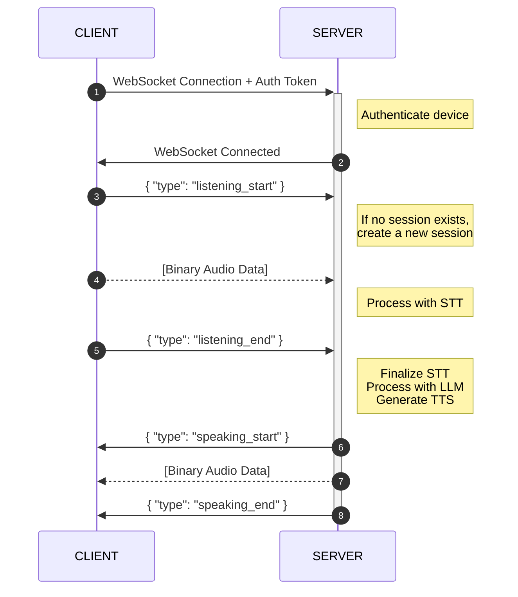

# Session Management Design

## WebSocket Communication Protocol

### Message Types

We will use the following intuitive message types for WebSocket communication:

- `listening_start`: Client starts listening to user's speech (sent by client)
- `listening_end`: Client stops listening and signals end of user input (sent by client)
- `speaking_start`: Server begins sending synthesized speech to client (sent by server)
- `speaking_end`: Server signals the end of synthesized speech output (sent by server)

### Session Management Flow

#### Session Initialization Flow

When a client connects and wants to start a conversation:



## Database Integration

### NoSQL Database Selection

- **MongoDB** will be used for rapid development with flexible schema
- Collections needed:
  - `sessions`: Store active conversation sessions with embedded messages
  - `devices`: Store device information

### Data Structures

#### Session Document Structure
```json
{
  "_id": "ObjectId",
  "device_id": "Reference to Device Document",
  "created_at": "Timestamp",
  "last_message_at": "Timestamp",
  "messages": [
    {
      "timestamp": "Timestamp",
      "role": "user|assistant",
      "content": "Message text content",
      "duration_ms": 1500,
      "metadata": {
        "transcription_confidence": 0.95,
        "emotion": "neutral"
      }
    }
  ],
  "metadata": {
    "language": "id-ID",
    "user_preferences": {}
  }
}
```

#### Device Document Structure
```json
{
  "_id": "ObjectId",
  "device_token": "Unique device authentication token",
  "name": "Device name or identifier",
  "created_at": "Timestamp",
  "last_active_at": "Timestamp",
  "status": "active|inactive|revoked",
  "metadata": {
    "model": "Device model",
    "os_version": "Operating system version",
    "location": "Optional location data"
  }
}
```

## Implementation Considerations

### 1. Repository Interface for Sessions
- Define a `SessionRepository` interface in the domain layer
- Implement MongoDB adapter for this interface

### 2. Session Expiration & Cleanup
- Implement a background task to clean up expired sessions
- Consider TTL indexes in MongoDB for automatic expiration

### 3. Error Handling for Session Edge Cases
- Handle session not found scenarios
- Handle race conditions when multiple devices access same session
- Handle connection drops during conversation

### 4. Session Context Transfer
- Continue existing session if last message was within 30 minutes
- Create new session if last message was more than 30 minutes ago
   We aim for simplicity for now, might revisit later.
- LLM integration for conversation history retrieval from embedded messages

### 5. Authentication Enhancements
- Session token in addition to device token
- Permission-based access to sessions

### 6. Monitoring and Analytics
- Session metrics collection
- Conversation quality analysis
- Performance tracking

### 7. Scaling Considerations
- Session sharding for high volume
   Do simple approach for now, no sharding.
- Connection pooling for MongoDB
- WebSocket connection distribution across multiple servers

### 8. Session Recovery Mechanism
- What happens if server crashes during a session
   Make sure the message and required information has been persisted
- How to resume interrupted conversations
   Everytime device is reconnected, check for existing session. Either to continue or create a new one.

### 9. Multiple Device Support
- There is no multiple device support for a single session.
- Each device must establish its own session.
- Session data is not shared between devices.

### 10. Rate Limiting and Abuse Prevention
- One device can only create one session at a time.
- One device can only activate one session at a time.

## Next Steps

1. **Define MongoDB Schema and Indexes**
   - Create schema definition files
   - Plan appropriate indexes for query performance

2. **Implement Session Repository**
   - Create MongoDB adapter for session storage
   - Add CRUD operations for sessions

3. **Update WebSocket Handler**
   - Modify to use the new message types
   - Integrate with session repository
   - Implement session validation logic

4. **Enhance Client Communication**
   - Document the new protocol for client developers
   - Create example client code for testing

5. **Add Monitoring**
   - Session creation/usage metrics
   - Performance monitoring for database operations
